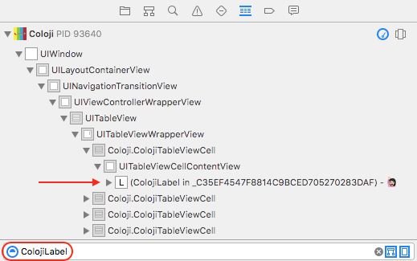

# Chapter 2: Xcode 8 Debugging Improvements

Xcode 8 adds some powerful updates to your debugging toolbox. Some of the most challenging runtime issues in development—race conditions and memory leaks—can now be automatically identified in the Issue navigator with runtime tools. The already excellent View Debugger has also gained some polish, and makes runtime debugging of constraints easier than ever.

This chapter will cover three tools:

- **View Debugging** allows you to visualize your layouts and see constraint definitions at runtime. Xcode 8 introduces warnings for constraint conflicts along with other convenience features.
- **Thread Sanitizer** is an all new runtime tool that alerts you to threading issues.
- **Memory Graph Debugger** provides visualization of your app's memory graph at a point in time and flags leaks in the Issue navigator.

You'll work with a simple app, Coloji, that displays a listing of colors and emojis. It has quite a few problems, and these debugging tools will make it much easier to determine a resolution to all of them.

TODO: prerequisites?

##Getting Started [Instruction]

This chapter's sample project, Coloji, uses a master detail design. The master is a table view with cells displaying either colors or emojis, while the current detail view displays colors full screen. The detail doesn't yet handle emojis, but you'll implement that shortly.

Below is a preview of what the finished project will look like:
TODO: Add screenshot showing master and detail view with an arrow from one of the cells

Open this chapter's starter project, **Coloji.xcodeproj**, and take a look around:

* **ColojiTableViewController.swift** manages the table view, backed by data stored in `colojiStore` (defined in **ColojiDataStore.swift**). The store is populated with colors and then emojis in `loadData()`.
* **Coloji.swift** has code used to configure the cells, which are built in **ColojiTableViewCell.swift**. It also generates the data source objects.
* **ColojiViewController.swift** controls the detail view, which currently only sets the background color. You'll update this to display emojis as well.

Build and run...and wait a while. The first issue becomes immediately evident, as it takes approximately one second to load, which is a lifetime for a user waiting to explore colors and emojis.

Try selecting a few cells, some at the top and some at the bottom, and you'll see several empty detail views and a few with background colors. This is because the emoji detail views are not yet implemented. t's not looking pretty.

TODO: Add screenshot showing master and detail view with an arrow from one of the cells

You already know there is an issue with the code that lays out the table view cells and a problem with slow startup time. Here's a quick rundown of all of the issues you're about to face, and the plan to tackle them:

1. You'll use the View Debugger to determine why the table view cells aren't loading as expected. Then you'll leverage the run time constraint debugger while creating the emoji detail view.
2. You're going to find that the slow load time is related to data loading. In fixing that, you'll run into a race condition and use Thread Sanitizer to hunt it down.
3. You'll notice—even now—that the memory footprint of Coloji continues to grow during use. You'll use the new Memory Graph Debugger to clean this up.

Since it's hard to debug what you can't see, View Debugging seems like a great place to start your cleanup efforts.

##View Debugging

Prior versions of the view debugger already displayed run time constraints of your views in the size inspector. The biggest addition in Xcode 8 is that you can also see warnings, similar to what you see at design time in interface builder. This is a much more user friendly method of debugging issues with constraints you create or modify at run time.

TODO: Show a warning in the inspector

There are plenty of more subtle enhancements as well. In the debug navigator, you can now filter the view hierarchy by memory address, class name or even super class name. From the Object inspector, you can jump straight to a view class. Debug snapshots are also much faster—70% faster by Apple's metrics.

TODO: Possibly show screenshots for the above, but I'm not sure how useful they'll be yet.

You'll start by using a few of these new features to determine why your cells are blank.

###Debugging the Cell

First, open **ColojiTableViewCell.swift** to get an idea of how the layout of the cell is defined. You'll see a setter for the `coloji` property that calls `addLabel(coloji:)` which places a `ColojiLabel` in the content view using autolayout to position it. In this same file, you can see `ColojiLabel` is a UILabel subclass that sets its background color for color cells and provides an emoji as text in emoji cells.

Since you don't see the ColojiLabel, the only view the code or storyboard put in the cell, that's a good place to focus your questions. Is the view actually on the content view? If so, what size is it and where does it sit within the content view?

Build and run, and stay on the blank table view. Now select the **Debug View Hierarchy** button in the Debug bar.


In the Debug navigator, enter **ColojiLabel** in the filter. This will show the view hierarchy leading to each label.



> **Note**: You can also try filtering for **UILabel**, and you'll see your ColojiLabels as well as the UILabel in the navigation bar. The ability to filter by parent class is a very useful new feature for complex layouts.

Select any of the labels, and take a look at the Size inspector. In the Constraints section, you'll be able to see all of the currently active constraints for the label. Looking over the constraints—you'll immediately see something is not right:


A 0 height and width certainly explains an invisible label! These constraints weren't set explicitly in the starter. However, they are the kind of thing that would be set if you forgot to turn off an auto resizing mask. TODO: reword the prior sentence

To quickly jump to the view's code, switch to the Object inspector. For public classes, an annotation will be present next to the **Class Name** allowing you to jump directly to the source. Because ColojiLabel is private, you won't see it.

Back in the debug navigator, move up the label's hierarchy a bit until you get to the public **ColojiTableViewCell**, which happens to reside in the same file as the label. In the Object inspector, you'll now be able to click the annotation to jump right to the source for this class.


Now inside **ColojiTableViewCell.swift**, find `addLabel(coloji:)` where the `label` is added to the `contentView` and constrained to its parent. Sure enough, nothing was done to prevent autoresizing masks from being converted into constraints. Add the following code, just after the label definition:

```swift
label.translatesAutoresizingMaskIntoConstraints = false
```


  * Intro [Theory]
    * What's new - run time constraint problem debugging, new view hierarchy filtering options
  * Debugging the Cell [Instruction]

    Determine why the cells are not displaying using the view debugger showing filtering and ‘jump to class’
  * Fixing the layout [Instruction] (this may be collapsed into the prior section)
    
    This is just instruction on fixing the autolayout, which will be brief
  * Adding the Detail View [Instruction]
  
   This is where we add a large emoji display for a detail view.  As in the screencast, we’ll originally leave off vertical constraints so it doesn’t work properly
  * Runtime Constraint Debugging [Instruction]

    debug the vertical centering issue with runtime debugging, then fix it

##Thread Sanitizer 
(I plan to have the async code already in the starter—which differs from the screencast—but may have users add this if this is too short)

* Intro  [Theory]
  * Review the dispatch group code that loads colors & emojis
  * Describe the assumption that the issue is a race condition
  * High level overview of the thread sanitizer
* Using Thread Sanitizer [Instruction]

  hunt down the race condition by looking at runtime threading issues
* Fixing the Race Condition [Instruction]

  Fix the race, verifying the results via build & run as well as sanitizer

##Memory Graph Debugging
* Intro [Theory]
  * Memory graph explorer and runtime issue tool
  * Describe use case for Debugger (compare to Profiler)
* Finding the Leak [Instruction]
  * Demonstrate memory issue with Coloji
  * Here we’ll use Memory Graph Debugger to identify the issue
* Fixing the Leak [Instruction]
* Improving Memory Usage [Instruction]

  Uncover and look at need to reuse UILabels in the tableview cells

##Where to Go From Here?
* WWDC Videos
* RW View Debugger tutorial (noted that not a ton has changed)


